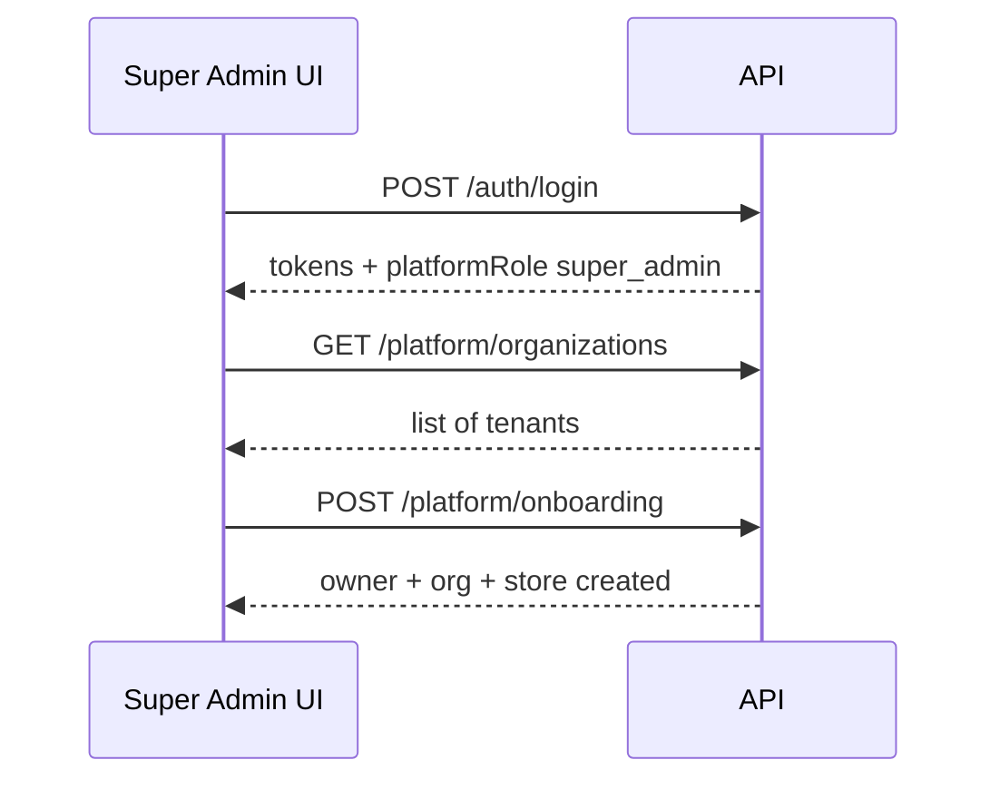
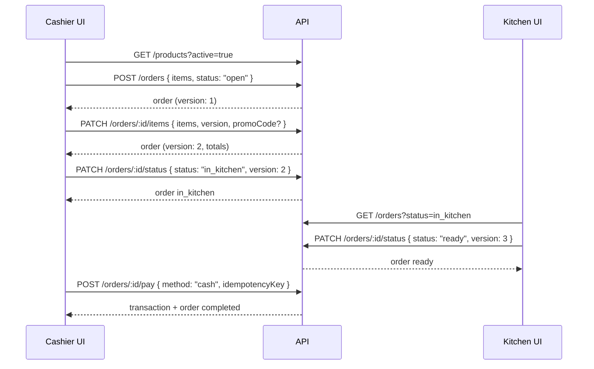

# Olsera Restaurant POS — Frontend Dashboard Integration Guide

This document is the primary reference for building the **Super Admin**, **Owner/Manager**, **Cashier (POS)**, and **Kitchen** frontends against the Olsera API.

**Base URL (local):** `http://localhost:3000/api/v1`  
**Swagger (interactive):** `http://localhost:3000/api/docs`  
**Default CORS origin:** `http://localhost:4200`

---

## Table of contents

1. [Architecture overview](#1-architecture-overview)
2. [Authentication & session](#2-authentication--session)
3. [API conventions](#3-api-conventions)
4. [Dashboard routing logic](#4-dashboard-routing-logic)
5. [Super Admin dashboard](#5-super-admin-dashboard)
6. [Owner / Manager dashboard](#6-owner--manager-dashboard)
7. [Cashier POS dashboard](#7-cashier-pos-dashboard)
8. [Kitchen display dashboard](#8-kitchen-display-dashboard)
9. [Screen-by-screen endpoint map](#9-screen-by-screen-endpoint-map)
10. [RBAC & navigation gating](#10-rbac--navigation-gating)
11. [Core user flows](#11-core-user-flows)
12. [Domain reference](#12-domain-reference)
13. [Error handling](#13-error-handling)
14. [Frontend state recommendations](#14-frontend-state-recommendations)

---

## 1. Architecture overview

The platform has **two layers**:

| Layer | Who | Purpose |
|-------|-----|---------|
| **Platform** | Super Admin (`platformRole: "super_admin"`) | Onboard restaurant owners, view all organizations |
| **Tenant** | Owner, Manager, Cashier, Kitchen | Day-to-day store operations scoped by `storeId` |

All tenant business data (categories, products, orders, etc.) is **scoped to a store**. The frontend must always know the **active store** when calling tenant endpoints.

```mermaid
flowchart TB
    subgraph auth [Auth Layer]
        LOGIN[POST /auth/login]
        ME[GET /auth/me]
    end

    subgraph routing [Route Decision]
        ME --> CHECK{platformRole?}
        CHECK -->|super_admin| PLATFORM[Super Admin App]
        CHECK -->|null| TENANT[Tenant App]
    end

    subgraph tenant [Tenant Bootstrap]
        TENANT --> STORES[GET /stores]
        STORES --> PICK[User picks active store]
        PICK --> CTX[GET /stores/:storeId/access-context]
        CTX --> NAV[Build nav from permissions[]]
    end

    subgraph pages [Dashboard Pages]
        NAV --> OVERVIEW[Overview / Analytics]
        NAV --> ORDERS[Orders]
        NAV --> TXN[Transactions]
        NAV --> MENU[Categories + Products + Promos]
        NAV --> SETTINGS[Store + Staff]
    end
```

---

## 2. Authentication & session

### 2.1 Login

```http
POST /auth/login
Content-Type: application/json

{
  "email": "owner@alicoffee.com",
  "password": "OwnerPass123"
}
```

**Response (200):**

```json
{
  "success": true,
  "data": {
    "user": {
      "id": "...",
      "email": "owner@alicoffee.com",
      "firstName": "Ali",
      "lastName": "Hassan",
      "platformRole": null,
      "status": "active"
    },
    "tokens": {
      "accessToken": "eyJ...",
      "refreshToken": "eyJ...",
      "expiresIn": "15m"
    }
  },
  "requestId": "..."
}
```

**Super admin login:** same endpoint — `user.platformRole` will be `"super_admin"`.

### 2.2 Public registration is disabled

```http
POST /auth/register  → 403
```

Owners are created only via Super Admin onboarding (`POST /platform/onboarding`).

### 2.3 Staff invite acceptance (public page)

Staff receive an invite token (from email or admin copy). No auth required.

```http
POST /auth/accept-invite
Content-Type: application/json

{
  "token": "<invite-token>",
  "password": "CashierPass123",
  "firstName": "Jane",
  "lastName": "Cashier"
}
```

Returns the same shape as login (`user` + `tokens`). Redirect to tenant app after success.

### 2.4 Token refresh

Access tokens expire in **15 minutes**. Refresh before expiry or on `401`.

```http
POST /auth/refresh
Content-Type: application/json

{ "refreshToken": "<refresh-token>" }
```

Returns new `accessToken` + rotated `refreshToken`.

### 2.5 Logout

```http
POST /auth/logout
Authorization: Bearer <access-token>
Content-Type: application/json

{ "refreshToken": "<refresh-token>" }
```

### 2.6 Current user profile

```http
GET /auth/me
Authorization: Bearer <access-token>
```

Use on app boot to restore session.

### 2.7 What to persist in the browser

| Key | Value |
|-----|-------|
| `accessToken` | JWT (memory or secure storage) |
| `refreshToken` | httpOnly cookie preferred; otherwise secure localStorage |
| `activeStoreId` | Selected store for tenant users |
| `user` | Cached profile from `/auth/me` |

---

## 3. API conventions

### 3.1 Authorization header

All protected routes:

```http
Authorization: Bearer <access-token>
```

### 3.2 Active store header (recommended)

For tenant routes, send the active store on every request:

```http
X-Store-Id: <active-store-id>
```

This should match the `:storeId` in the URL when present. Used by RBAC guards for store context resolution.

### 3.3 Standard response envelope

**Success:**

```json
{
  "success": true,
  "data": { ... },
  "requestId": "optional-uuid"
}
```

**Paginated list:**

```json
{
  "success": true,
  "data": [ ... ],
  "meta": {
    "page": 1,
    "limit": 20,
    "total": 45,
    "totalPages": 3
  },
  "requestId": "..."
}
```

**Error:**

```json
{
  "success": false,
  "statusCode": 403,
  "message": "Forbidden resource",
  "error": "Forbidden",
  "timestamp": "2026-06-29T12:00:00.000Z",
  "path": "/api/v1/stores/.../products",
  "requestId": "..."
}
```

Validation errors return `message` as a string array.

### 3.4 HTTP status codes you will see

| Code | Meaning |
|------|---------|
| `200` | OK (including pay, validate, refund) |
| `201` | Created |
| `400` | Validation / business rule (expired promo, invalid order transition) |
| `401` | Missing or expired token → refresh or redirect to login |
| `403` | Authenticated but missing permission |
| `404` | Resource not found |
| `409` | Conflict (duplicate slug/code, optimistic lock version mismatch) |

---

## 4. Dashboard routing logic

After login, branch on `user.platformRole`:

```typescript
// Pseudocode — app router guard
async function resolveDashboard(user: AuthUser) {
  if (user.platformRole === 'super_admin') {
    return '/platform/organizations';
  }

  const stores = await api.get('/stores');

  if (stores.data.length === 0) {
    return '/no-access'; // edge case: user exists but no membership
  }

  if (stores.data.length === 1) {
    setActiveStore(stores.data[0].id);
  } else {
    return '/select-store'; // multi-store switcher
  }

  const storeId = getActiveStoreId();
  const context = await api.get(`/stores/${storeId}/access-context`);

  // Optional: route staff to role-specific layouts
  switch (context.data.role) {
    case 'kitchen':
      return '/kitchen/orders';
    case 'cashier':
      return '/pos/orders';
    default:
      return '/dashboard/overview'; // owner / manager
  }
}
```

### Store switcher flow

1. `GET /stores` — list all stores user can access (each item includes `role`)
2. User selects store → save `activeStoreId`
3. `GET /stores/:storeId/access-context` — load permissions for nav + feature flags
4. Re-fetch store-scoped data for current page

**Store list item shape:**

```json
{
  "id": "...",
  "organizationId": "...",
  "name": "Ali Coffee & Eatery",
  "slug": "ali-coffee-eatery",
  "currency": "USD",
  "timezone": "UTC",
  "status": "active",
  "role": "owner"
}
```

**Access context shape:**

```json
{
  "storeId": "...",
  "organizationId": "...",
  "role": "owner",
  "permissions": [
    "stores:read",
    "stores:create",
    "categories:read",
    "products:create",
    "orders:create",
    "analytics:read",
    ...
  ]
}
```

Use `permissions[]` to show/hide sidebar items — never hard-code by role name alone (org owners get extra `stores:create`).

---

## 5. Super Admin dashboard

**Audience:** Olsera platform staff  
**Login:** user with `platformRole: "super_admin"`  
**Cannot access:** tenant routes (returns `403` — "Super admins use platform routes")

### 5.1 Pages & endpoints

| Page | Endpoints | Notes |
|------|-----------|-------|
| **Login** | `POST /auth/login` | Same as tenant |
| **Organizations list** | `GET /platform/organizations` | All onboarded tenants |
| **Onboard tenant** | `POST /platform/onboarding` | Atomic: owner + org + first store |

### 5.2 Onboard tenant

```http
POST /platform/onboarding
Authorization: Bearer <super-admin-token>
Content-Type: application/json

{
  "owner": {
    "email": "owner@newrestaurant.com",
    "password": "OwnerPass123",
    "firstName": "Ali",
    "lastName": "Hassan"
  },
  "organization": {
    "name": "Ali Coffee Group"
  },
  "store": {
    "name": "Ali Coffee & Eatery",
    "currency": "KES",
    "timezone": "Africa/Nairobi"
  }
}
```

**Response (201):** `{ owner, organization, store }` — share owner credentials securely (no invite email flow yet).

### 5.3 Super Admin flow



---

## 6. Owner / Manager dashboard

**Audience:** Business owners and store managers  
**Scope:** All pages below require active `storeId`  
**Difference:** Org **owners** also have `stores:create` (can add new store locations). Managers cannot.

### 6.1 Sidebar → API mapping

| Sidebar item | Primary endpoints | Permission required |
|--------------|-------------------|---------------------|
| **Overview** | `GET /stores/:storeId/analytics/overview` | `analytics:read` |
| **Orders** | `GET /stores/:storeId/orders` | `orders:read` |
| **Transactions** | `GET /stores/:storeId/transactions` | `transactions:read` |
| **Analytics** | `GET .../analytics/sales-by-day`, `GET .../analytics/top-products` | `analytics:read` |
| **Categories** | CRUD `/stores/:storeId/categories` | `categories:*` |
| **Products** | CRUD `/stores/:storeId/products` | `products:*` |
| **Promo** | CRUD `/stores/:storeId/promos` | `promos:*` |
| **Store settings** | `GET/PATCH /stores/:storeId` | `stores:read`, `stores:update` |
| **Staff invites** | `GET/POST /stores/:storeId/invites` | `invites:read`, `invites:create` |
| **Add store** (owner only) | `POST /stores` | `stores:create` |

### 6.2 Overview page

Daily snapshot for the dashboard home.

```http
GET /stores/:storeId/analytics/overview?date=2026-06-29
```

**Response data:**

```json
{
  "date": "2026-06-29",
  "sales": 1250.50,
  "orderCount": 42,
  "avgTicket": 29.77
}
```

Omit `date` to use today (UTC). For store-local "today", pass the date string in the store's timezone (future enhancement: server-side timezone from store settings).

### 6.3 Analytics page (charts)

**Sales by day (line/bar chart):**

```http
GET /stores/:storeId/analytics/sales-by-day?fromDate=2026-06-01&toDate=2026-06-30
```

Default range: last 7 days if dates omitted.

**Response data:**

```json
{
  "fromDate": "2026-06-01",
  "toDate": "2026-06-30",
  "points": [
    { "date": "2026-06-28", "sales": 980, "orderCount": 35, "avgTicket": 28 },
    { "date": "2026-06-29", "sales": 1250.5, "orderCount": 42, "avgTicket": 29.77 }
  ]
}
```

**Top products (table):**

```http
GET /stores/:storeId/analytics/top-products?fromDate=2026-06-01&toDate=2026-06-30&limit=10
```

Default range: last 30 days.

### 6.4 Categories page

| Action | Method | Endpoint |
|--------|--------|----------|
| List | `GET` | `/stores/:storeId/categories?active=true` |
| Create | `POST` | `/stores/:storeId/categories` |
| Get one | `GET` | `/stores/:storeId/categories/:categoryId` |
| Update | `PATCH` | `/stores/:storeId/categories/:categoryId` |
| Delete (soft) | `DELETE` | `/stores/:storeId/categories/:categoryId` |

**Create body:**

```json
{ "name": "Drinks", "sortOrder": 1, "isActive": true }
```

Slug is auto-generated from name. Duplicate slug in store → `409`.

### 6.5 Products page

| Action | Method | Endpoint |
|--------|--------|----------|
| List | `GET` | `/stores/:storeId/products?active=true&categoryId=` |
| Create | `POST` | `/stores/:storeId/products` |
| Get one | `GET` | `/stores/:storeId/products/:productId` |
| Update | `PATCH` | `/stores/:storeId/products/:productId` |
| Delete (soft) | `DELETE` | `/stores/:storeId/products/:productId` |

**Create body:**

```json
{
  "name": "Cappuccino",
  "categoryId": "<category-id>",
  "price": 4.5,
  "description": "Espresso with steamed milk foam",
  "sku": "CAP-001",
  "sortOrder": 1,
  "isActive": true
}
```

### 6.6 Promo page

| Action | Method | Endpoint |
|--------|--------|----------|
| List | `GET` | `/stores/:storeId/promos?active=true` |
| Create | `POST` | `/stores/:storeId/promos` |
| Get one | `GET` | `/stores/:storeId/promos/:promoId` |
| Update | `PATCH` | `/stores/:storeId/promos/:promoId` |
| Delete (soft) | `DELETE` | `/stores/:storeId/promos/:promoId` |

**Create body:**

```json
{
  "name": "Summer Sale",
  "code": "SUMMER20",
  "type": "percentage",
  "value": 20,
  "minOrderAmount": 25,
  "maxUses": 100,
  "startsAt": "2026-06-01T00:00:00.000Z",
  "endsAt": "2026-08-31T23:59:59.999Z",
  "isActive": true
}
```

`type`: `"percentage"` (0–100) or `"fixed"` (currency amount).

### 6.7 Orders page (management view)

| Action | Method | Endpoint |
|--------|--------|----------|
| List | `GET` | `/stores/:storeId/orders?status=&fromDate=&toDate=&page=&limit=` |
| Get one | `GET` | `/stores/:storeId/orders/:orderId` |
| Update status | `PATCH` | `/stores/:storeId/orders/:orderId/status` |

Filter by status: `draft`, `open`, `in_kitchen`, `ready`, `completed`, `cancelled`.

### 6.8 Transactions page

| Action | Method | Endpoint |
|--------|--------|----------|
| List | `GET` | `/stores/:storeId/transactions?status=&method=&fromDate=&toDate=&page=&limit=` |
| Get one | `GET` | `/stores/:storeId/transactions/:transactionId` |
| Refund | `POST` | `/stores/:storeId/transactions/:transactionId/refund` |

**Payment methods:** `cash`, `card`, `ewallet`  
**Transaction statuses:** `pending`, `completed`, `refunded`

Refund body (optional reason):

```json
{ "reason": "Customer requested refund" }
```

### 6.9 Store settings & staff

```http
GET  /stores/:storeId
PATCH /stores/:storeId          { "name", "currency", "timezone" }

GET  /stores/:storeId/invites
POST /stores/:storeId/invites   { "email", "role": "manager"|"cashier"|"kitchen" }
```

Invite response includes `inviteToken` — display/copy for staff (email integration TBD).

**Create additional store (org owner only):**

```http
POST /stores
{ "organizationId": "...", "name": "Ali Coffee Westlands", "currency": "KES" }
```

```http
GET /organizations/me   — list orgs user belongs to (for organizationId when creating store)
```

---

## 7. Cashier POS dashboard

**Audience:** Front-of-house staff taking orders and payments  
**Layout suggestion:** Simplified — Products grid + active order + checkout (no analytics, no menu management)

### 7.1 Pages & endpoints

| POS screen | Endpoints |
|------------|-----------|
| **Login / select store** | `POST /auth/login`, `GET /stores`, `GET /stores/:storeId/access-context` |
| **Menu (read-only)** | `GET /stores/:storeId/categories?active=true`, `GET /stores/:storeId/products?active=true&categoryId=` |
| **New order** | `POST /stores/:storeId/orders` |
| **Edit cart** | `PATCH /stores/:storeId/orders/:orderId/items` |
| **Apply promo** | Include `promoCode` in create/items PATCH, or `POST /stores/:storeId/promos/validate` |
| **Send to kitchen** | `PATCH /stores/:storeId/orders/:orderId/status` → `in_kitchen` |
| **Checkout / pay** | `POST /stores/:storeId/orders/:orderId/pay` |
| **Order history (today)** | `GET /stores/:storeId/orders?status=completed&fromDate=&toDate=` |

### 7.2 Cashier cannot access

- `GET /stores/:storeId/transactions` (no `transactions:read`)
- `GET /stores/:storeId/analytics/*` (no `analytics:read`)
- Category/product/promo CRUD (read-only menu)
- Staff invites, store settings update
- Refunds (no `transactions:refund`)

### 7.3 Promo validate (at checkout)

Cashiers can validate promos without managing them:

```http
POST /stores/:storeId/promos/validate
{ "code": "SUMMER20", "subtotal": 50 }
```

**Response:**

```json
{
  "promo": { "id": "...", "code": "SUMMER20", "type": "percentage", "value": 20, ... },
  "discountAmount": 10,
  "subtotal": 50,
  "totalAfterDiscount": 40
}
```

Requires `orders:create` permission.

---

## 8. Kitchen display dashboard

**Audience:** Kitchen staff  
**Layout suggestion:** Full-screen order queue — no menu editing, no payments

### 8.1 Pages & endpoints

| Screen | Endpoints |
|--------|-----------|
| **Login / select store** | Same as cashier |
| **Order queue** | `GET /stores/:storeId/orders?status=open&status=in_kitchen` (or fetch `open` + `in_kitchen` separately) |
| **Mark in kitchen** | `PATCH .../orders/:orderId/status` → `{ "status": "in_kitchen", "version": N }` |
| **Mark ready** | `PATCH .../orders/:orderId/status` → `{ "status": "ready", "version": N }` |

### 8.2 Kitchen cannot access

- Create orders (`orders:create` missing)
- Pay orders (`transactions:create` missing)
- Menu management, analytics, transactions list

### 8.3 Polling recommendation

Kitchen UI should poll order list every **5–10 seconds** or use WebSockets later:

```http
GET /stores/:storeId/orders?status=in_kitchen&limit=50
GET /stores/:storeId/orders?status=open&limit=50
```

---

## 9. Screen-by-screen endpoint map

Quick lookup table for frontend developers.

### Super Admin

| Screen | Endpoints |
|--------|-----------|
| Login | `POST /auth/login` |
| Org list | `GET /platform/organizations` |
| Onboard form | `POST /platform/onboarding` |

### Shared tenant (all roles)

| Screen | Endpoints |
|--------|-----------|
| Login | `POST /auth/login` |
| Accept invite | `POST /auth/accept-invite` |
| Session restore | `GET /auth/me`, `POST /auth/refresh` |
| Store switcher | `GET /stores` |
| Permissions bootstrap | `GET /stores/:storeId/access-context` |

### Owner / Manager only

| Screen | Endpoints |
|--------|-----------|
| Overview | `GET /stores/:storeId/analytics/overview` |
| Analytics charts | `GET .../analytics/sales-by-day`, `GET .../analytics/top-products` |
| Categories CRUD | `/stores/:storeId/categories` |
| Products CRUD | `/stores/:storeId/products` |
| Promos CRUD | `/stores/:storeId/promos` |
| Transactions list | `GET /stores/:storeId/transactions` |
| Refund modal | `POST /stores/:storeId/transactions/:id/refund` |
| Store settings | `GET/PATCH /stores/:storeId` |
| Staff invites | `GET/POST /stores/:storeId/invites` |
| New store | `POST /stores`, `GET /organizations/me` |

### Cashier POS

| Screen | Endpoints |
|--------|-----------|
| Menu | `GET .../categories`, `GET .../products` |
| New order | `POST .../orders` |
| Edit cart | `PATCH .../orders/:id/items` |
| Promo check | `POST .../promos/validate` |
| Status updates | `PATCH .../orders/:id/status` |
| Pay | `POST .../orders/:id/pay` |

### Kitchen

| Screen | Endpoints |
|--------|-----------|
| Queue | `GET .../orders?status=open`, `GET .../orders?status=in_kitchen` |
| Update status | `PATCH .../orders/:id/status` |

---

## 10. RBAC & navigation gating

Gate UI with **`permissions[]`** from access context, not role strings.

| Permission | Owner | Manager | Cashier | Kitchen |
|------------|:-----:|:-------:|:-------:|:-------:|
| `stores:read` | ✓ | ✓ | ✓ | ✓ |
| `stores:create` | ✓* | | | |
| `stores:update` | ✓ | ✓ | | |
| `invites:create` | ✓ | ✓ | | |
| `invites:read` | ✓ | ✓ | | |
| `categories:read` | ✓ | ✓ | ✓ | ✓ |
| `categories:create/update/delete` | ✓ | ✓ | | |
| `products:read` | ✓ | ✓ | ✓ | ✓ |
| `products:create/update/delete` | ✓ | ✓ | | |
| `promos:read/create/update/delete` | ✓ | ✓ | | |
| `promos:validate` (via `orders:create`) | ✓ | ✓ | ✓ | |
| `orders:create` | ✓ | ✓ | ✓ | |
| `orders:read` | ✓ | ✓ | ✓ | ✓ |
| `orders:update` | ✓ | ✓ | ✓ | ✓ |
| `transactions:create` (pay) | ✓ | ✓ | ✓ | |
| `transactions:read` | ✓ | ✓ | | |
| `transactions:refund` | ✓ | ✓ | | |
| `analytics:read` | ✓ | ✓ | | |

\* `stores:create` is granted to **org owners** in addition to their store role permissions.

**Example nav guard:**

```typescript
function can(permission: string) {
  return accessContext.permissions.includes(permission);
}

// Sidebar
{can('analytics:read') && <NavItem to="/overview" />}
{can('orders:read') && <NavItem to="/orders" />}
{can('transactions:read') && <NavItem to="/transactions" />}
{can('products:create') && <NavItem to="/products" />}
```

---

## 11. Core user flows

### 11.1 POS order → kitchen → pay (happy path)



### 11.2 Order status state machine

```
draft ──→ open ──→ in_kitchen ──→ ready ──→ completed
  │         │           │           │
  └─────────┴───────────┴───────────┴──→ cancelled
```

| From | Allowed next |
|------|--------------|
| `draft` | `open`, `cancelled` |
| `open` | `in_kitchen`, `cancelled` |
| `in_kitchen` | `ready`, `cancelled` |
| `ready` | `completed`, `cancelled` |
| `completed` | *(terminal)* |
| `cancelled` | *(terminal)* |

**Rules for frontend:**
- Items editable only in `draft` or `open` — use `PATCH .../items` with current `version`
- Every status/items update requires `version` — on `409`, refetch order and retry
- Payment (`POST .../pay`) requires order in `open` or `ready`
- `completed` can also be reached via pay (preferred) or manual status update

### 11.3 Create order

```http
POST /stores/:storeId/orders
{
  "status": "draft",
  "items": [
    { "productId": "...", "quantity": 2, "notes": "Extra hot" }
  ],
  "promoCode": "SUMMER20",
  "taxRate": 10,
  "notes": "Table 5"
}
```

Product **name and price are snapshotted** — safe to display historical orders even if menu changes later.

### 11.4 Update order items

```http
PATCH /stores/:storeId/orders/:orderId/items
{
  "version": 2,
  "items": [
    { "productId": "...", "quantity": 3 }
  ],
  "promoCode": "SUMMER20",
  "taxRate": 10
}
```

Replaces the entire items array and recalculates totals.

### 11.5 Update order status

```http
PATCH /stores/:storeId/orders/:orderId/status
{
  "status": "in_kitchen",
  "version": 2
}
```

### 11.6 Pay order

```http
POST /stores/:storeId/orders/:orderId/pay
{
  "method": "cash",
  "idempotencyKey": "pay-20260629-table5-001",
  "externalRef": "terminal-ref-optional"
}
```

**Response:**

```json
{
  "transaction": {
    "id": "...",
    "amount": 12.5,
    "method": "cash",
    "status": "completed",
    "orderNumber": "ORD-20260629-0001",
    ...
  },
  "order": {
    "status": "completed",
    "total": 12.5,
    ...
  },
  "idempotentReplay": false
}
```

**Idempotency:** Always generate a unique `idempotencyKey` per payment attempt. On network retry, reuse the same key — API returns the original transaction with `idempotentReplay: true`.

Suggested key format: `pay-{date}-{orderId}-{attempt}` or UUID.

### 11.7 Owner onboarding (Super Admin)

Super Admin creates owner → owner logs in → lands in tenant app with one store pre-configured → starts adding categories/products.

### 11.8 Staff invite

Owner/Manager invites → copy `inviteToken` → staff opens `/accept-invite?token=...` → `POST /auth/accept-invite` → login complete → `GET /stores`.

---

## 12. Domain reference

### Order response (key fields)

```json
{
  "id": "...",
  "orderNumber": "ORD-20260629-0001",
  "status": "open",
  "items": [
    {
      "id": "...",
      "productId": "...",
      "name": "Cappuccino",
      "quantity": 2,
      "unitPrice": 4.5,
      "lineTotal": 9,
      "notes": ""
    }
  ],
  "subtotal": 9,
  "taxRate": 0,
  "taxAmount": 0,
  "discountAmount": 1,
  "promoCode": "ORDER10",
  "total": 8,
  "version": 2,
  "notes": "Table 5",
  "createdAt": "...",
  "completedAt": null
}
```

### Transaction response (key fields)

```json
{
  "id": "...",
  "orderId": "...",
  "orderNumber": "ORD-20260629-0001",
  "amount": 8,
  "method": "cash",
  "status": "completed",
  "idempotencyKey": "pay-...",
  "processedAt": "...",
  "refundedAt": null
}
```

### Store member roles

| Role | Dashboard |
|------|-----------|
| `owner` | Full owner dashboard + `stores:create` if org owner |
| `manager` | Same as owner except cannot create new stores |
| `cashier` | POS — orders + pay |
| `kitchen` | Kitchen display — order status only |

---

## 13. Error handling

| Scenario | Status | Frontend action |
|----------|--------|-----------------|
| Token expired | `401` | Call `POST /auth/refresh`, retry once |
| Missing permission | `403` | Hide action or show "Access denied" |
| Validation error | `400` | Show field errors from `message[]` |
| Duplicate slug/code | `409` | Show "Already exists" on form |
| Optimistic lock conflict | `409` | Refetch order, show "Updated elsewhere — review and retry" |
| Promo expired/invalid | `400` | Show promo error at checkout |
| Order already paid | `400` | Redirect to receipt / transaction view |
| Super admin on tenant route | `403` | Redirect to `/platform` |

---

## 14. Frontend state recommendations

### Global app state

```typescript
type AppState = {
  user: AuthUser | null;
  tokens: { accessToken: string; refreshToken: string } | null;
  activeStoreId: string | null;
  accessContext: StoreContextPayload | null;
  stores: UserStoreSummary[];
};
```

### Bootstrap sequence (tenant app)

```
1. GET /auth/me                    → restore user
2. GET /stores                     → populate store switcher
3. Resolve activeStoreId           → localStorage or first store
4. GET /stores/:id/access-context  → permissions + role
5. Render layout with gated nav
6. Fetch page-specific data
```

### API client interceptor (pseudocode)

```typescript
axios.interceptors.request.use((config) => {
  config.headers.Authorization = `Bearer ${getAccessToken()}`;
  if (activeStoreId) {
    config.headers['X-Store-Id'] = activeStoreId;
  }
  return config;
});

axios.interceptors.response.use(
  (res) => res,
  async (error) => {
    if (error.response?.status === 401 && !error.config._retry) {
      await refreshTokens();
      error.config._retry = true;
      return axios(error.config);
    }
    throw error;
  }
);
```

### Suggested route structure (React example)

```
/login
/accept-invite
/platform
  /organizations
  /onboarding
/select-store
/dashboard                    (owner/manager layout)
  /overview
  /orders
  /orders/:orderId
  /transactions
  /analytics
  /categories
  /products
  /promos
  /settings
  /staff
/pos                          (cashier layout)
  /orders
  /orders/:orderId/checkout
/kitchen
  /orders
```

---

## Appendix: Full endpoint index

| Method | Path | Tag |
|--------|------|-----|
| `GET` | `/health` | Health |
| `POST` | `/auth/login` | Auth |
| `POST` | `/auth/accept-invite` | Auth |
| `POST` | `/auth/refresh` | Auth |
| `POST` | `/auth/logout` | Auth |
| `GET` | `/auth/me` | Auth |
| `POST` | `/platform/onboarding` | Platform |
| `GET` | `/platform/organizations` | Platform |
| `GET` | `/organizations/me` | Organizations |
| `GET` | `/stores` | Stores |
| `POST` | `/stores` | Stores |
| `GET` | `/stores/:storeId` | Stores |
| `PATCH` | `/stores/:storeId` | Stores |
| `POST` | `/stores/:storeId/invites` | Stores |
| `GET` | `/stores/:storeId/invites` | Stores |
| `GET` | `/stores/:storeId/access-context` | RBAC |
| `GET` | `/stores/:storeId/categories` | Categories |
| `POST` | `/stores/:storeId/categories` | Categories |
| `GET` | `/stores/:storeId/categories/:id` | Categories |
| `PATCH` | `/stores/:storeId/categories/:id` | Categories |
| `DELETE` | `/stores/:storeId/categories/:id` | Categories |
| `GET` | `/stores/:storeId/products` | Products |
| `POST` | `/stores/:storeId/products` | Products |
| `GET` | `/stores/:storeId/products/:id` | Products |
| `PATCH` | `/stores/:storeId/products/:id` | Products |
| `DELETE` | `/stores/:storeId/products/:id` | Products |
| `GET` | `/stores/:storeId/promos` | Promos |
| `POST` | `/stores/:storeId/promos` | Promos |
| `POST` | `/stores/:storeId/promos/validate` | Promos |
| `GET` | `/stores/:storeId/promos/:id` | Promos |
| `PATCH` | `/stores/:storeId/promos/:id` | Promos |
| `DELETE` | `/stores/:storeId/promos/:id` | Promos |
| `GET` | `/stores/:storeId/orders` | Orders |
| `POST` | `/stores/:storeId/orders` | Orders |
| `GET` | `/stores/:storeId/orders/:id` | Orders |
| `PATCH` | `/stores/:storeId/orders/:id/items` | Orders |
| `PATCH` | `/stores/:storeId/orders/:id/status` | Orders |
| `POST` | `/stores/:storeId/orders/:id/pay` | Transactions |
| `GET` | `/stores/:storeId/transactions` | Transactions |
| `GET` | `/stores/:storeId/transactions/:id` | Transactions |
| `POST` | `/stores/:storeId/transactions/:id/refund` | Transactions |
| `GET` | `/stores/:storeId/analytics/overview` | Analytics |
| `GET` | `/stores/:storeId/analytics/sales-by-day` | Analytics |
| `GET` | `/stores/:storeId/analytics/top-products` | Analytics |

---

*Generated for Olsera Restaurant POS Server — align with Swagger at `/api/docs` for live schema details.*
